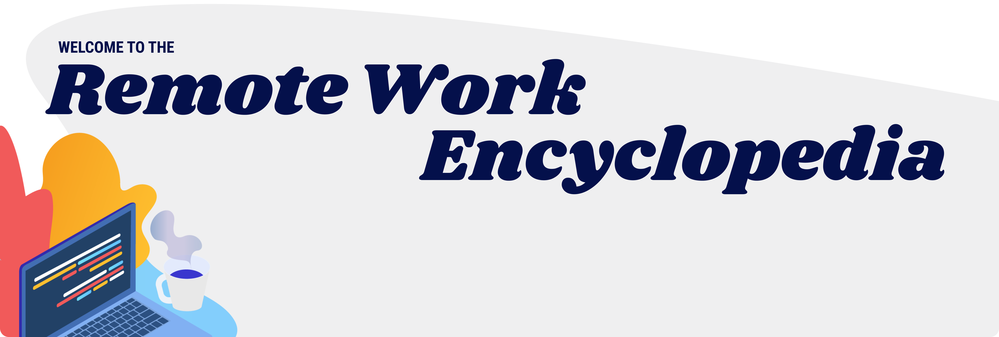

# Introduction

We are living in a global knowledge economy. People who might never meet face-to-face are working together daily through the internet. Knowledge work is becoming more accessible for people everywhere in the world, and technology talent is no longer exclusive to Silicon Valley.

We created this guide to help more people join the internet economy, and gain flexibility and independence in their work life. This guide is based off of our experience originally as remote workers ourselves, and now as a 100% remote team. This encyclopedia is open source, and we hope that the whole remote community will contribute to make it better over time.

Whether you’re looking for a more flexible way to work as a maker, or to build an amazing remote team - this guide will help you get started, stay productive, and build a better future of work.

## Our story

In the year 2017, [Emma](https://www.moonlightwork.com/app/users/2) and [Philip](https://www.moonlightwork.com/app/users/1) were young and eager developers working in the tech world. They had enough experience to be specialized in their respective fields (design and engineering), but each had the entrepreneurial itch.

Silicon Valley was becoming more overpriced and homogenous, so they decided to sell all of their belongings and leave San Francisco to become digital nomads. Knowing that "onsite-only" companies were open to hiring experienced remote contractors, the two took their talents to Mexico City to work remotely. Free of the tech bubble of the Bay Area at last!

Living off of street tacos, they were still able to freelance for Silicon Valley companies to pay the bills. They loved the flexibility to work where they wanted and set their own schedules.

Philip and Emma spent two years traveling and working. They met developers in each city, and wondered why they had easier access to quality work than the people they were meeting. The answer was that they knew people in the Silicon Valley startup scene. This gave them a broad network of funded startups to sell their experience to.

Platforms like LinkedIn didn’t make it easy to build a new network - just to leverage existing ones. And, bad experiences with outsourcing made many startup founders hesitant to work with people they couldn’t monitor in-person.

Factoring all this in, the duo began to build [Moonlight](https://www.moonlightwork.com) - a professional network of software developers - with the goal of helping the world work together to build the future.

Today Moonlight's community helps thousands of developers get access to flexible work and build careers outside of the Bay Area. Companies ranging from one-person startups to publicly-traded companies use the platform to build their teams.

## How to use this encyclopedia

Our goal in writing this is to keep it as tactical as possible, and to address both hiring and finding work. So, feel free to skip around to different sections as you find them relevant.

If you have any feedback, email us at [team@moonlightwork.com](mailto:team@moonlightwork.com), or [contribute directly on Github](https://github.com/moonlightwork/remote-work-encyclopedia).

