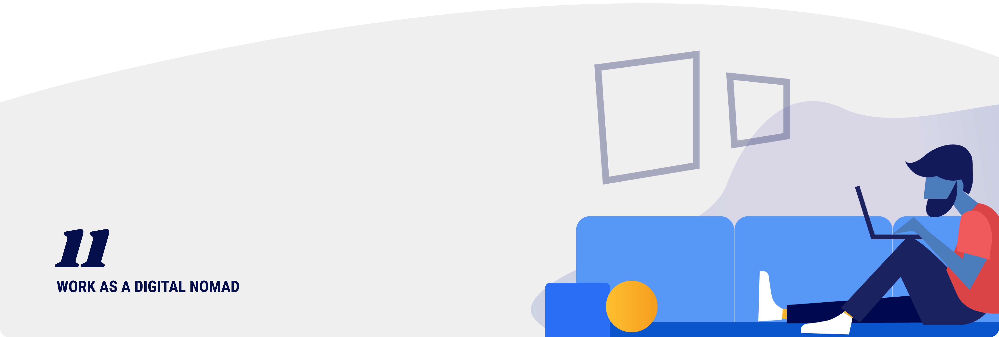

# Work as a digital nomad

We’re picking back up on the introduction story! After four months in Mexico City, Emma and Philip (Moonlight founders) traded in their taco diet to try out some other cities around the world. They lived as digital nomads for over two years while building a platform where like-minded individuals could do the same.

They spent 2-4 months in each city while working remotely the whole time. It was an amazing adventure, but also took lots of planning, financial stress, and feelings of isolation. Not even #TacoTuesdays can remedy that.

The idea of doing what you love from anywhere in the world is freeing and exciting! 

But, there are many logistical and financial obstacles to overcome before you can launch your new flexible life. It’s surprising how many things are set up with the requirement that you have a physical home, and a permanent residence.

<ClientOnly>
  <Tweet id="954156815234854912" :options="{ conversation: 'none' }" />
</ClientOnly>

## Set up a virtual mailbox

Yes, you still need an address for many things. Credit cards, voting, taxes, medical bills, insurance, prescriptions - all of these life obligations require that you have a "physical address". 

These virtual mailbox services will scan your mail, send you PDF copies, process checks, recycle what you don’t need, and forward your mail when needed. They are HIPPA compliant, and trusted by many large organizations.

- [Earth Class Mail](https://www.earthclassmail.com): Make business mail digital and actionable. Earth Class Mail gets paper out of your office and into action.

- [Virtual Post Mail](https://www.virtualpostmail.com): Our virtual mailbox service offers permanent street addresses, mail scanning, mail forwarding, check deposits, registered agent services, and more.

- [Traveling Mailbox](https://travelingmailbox.com): View and manage your mail online anywhere with an affordable online postal mailbox. We also forward your mail and packages anywhere in the world!

## Get a travel credit card

If you are moving around a lot, take advantage of cards with points on travel and other perks. Prioritize cards that include travel insurance and lounge access at the airport (built in co-working!). You may have to pay annually for access to some of these cards, but it will more than pay itself back if you are flying or paying for accommodations frequently. 

- [Amex Platinum Card](https://www.americanexpress.com/us/credit-cards/card/platinum/): Unique Experiences. Exceptional Services & Rewards.

- [Capital One Venture Card](https://www.capitalone.com/credit-cards/venture/): Unlimited 2X Miles with 50,000 Bonus Miles.

- [Chase Sapphire Reserve](https://creditcards.chase.com/rewards-credit-cards/chase-sapphire-reserve): 3X Points on Travel and Dining from airfare and hotels to fine dining and cafés.

- [The best travel rewards credit cards of 2019](https://thepointsguy.com/guide/top-travel-rewards-credit-cards-pm/?utm_source=google&utm_medium=cpc&utm_campaign=NBDtraB1-%2Btravel%20%2Bcredit%20%2Bcards-349174787509&utm_term=%2Btravel%20%2Bcredit%20%2Bcards&utm_cmpid=1044434605&utm_adgid=50438684879&utm_tgtid=kwd-326141598924&utm_mt=b&utm_adid=349174787509&utm_dvc=c&utm_ntwk=g&utm_adpos=1t1&utm_plcmnt=&utm_locphysid=9073497&utm_locintid=&utm_feeditemid=&utm_devicemdl=&utm_plcmnttgt=&utm_misc=&gclid=CjwKCAiAwZTuBRAYEiwAcr67OVC56IQQaQ7bM9dvFE_bhdbTtM-qJt3eLbbEMrTYkSRbGXZme5hY1RoCsTgQAvD_BwE): In this guide I’ll review all the details, including bonus offers and perks such as Global Entry fee credits and Priority Pass lounge access, to bring you a list of the very best cards.

## Borders, laws, and visas

Border security and immigrant regulation is a very real challenge when you are traveling for extended periods of time. Make sure you understand how long you can stay in a country, what the local laws are, and what paperwork you may need to enter, work, and reside there.

- [Global entry](https://www.cbp.gov/travel/trusted-traveler-programs/global-entry) or [TSA pre-check](https://www.tsa.gov/precheck): Expedited security at airports in the United States.

- [Clear](https://www.clearme.com/): CLEAR uses your eyes and fingerprints to confirm your identity – helping you breeze through airports, stadiums and more. 1. Arrive relaxed. Take it easy knowing you'll get through security in minutes.

- [Smart Traveler Enrollment Program](https://step.state.gov/): The Smart Traveler Enrollment Program (STEP) is a free service to allow U.S. citizens and nationals traveling and living abroad to enroll their trip with the nearest U.S. Embassy or Consulate.

- [U.S. Passports and International Travel](https://travel.state.gov/content/passports/en/country.html): The State Department’s Office of American Citizens Services and Crisis Management (ACS) administers the Consular Information Program, which informs the public of conditions abroad that may affect their safety and security. Country Specific Information, Travel Alerts, and Travel Warnings are vital parts of this program.

- [E-residency](https://e-resident.gov.ee/become-an-e-resident/): Estonia is the first country to offer e-Residency, a government-issued digital identity and status that provides entrepreneurs with access to Estonia’s transparent digital business environment. 

- [Nomadic Matt’s Travel Site](https://www.nomadicmatt.com/): Travel smarter, cheaper, longer.  Where do you want to go?

<ClientOnly>
  <Tweet id="1156248018104070145" :options="{ conversation: 'none' }" />
</ClientOnly>

## Taxes

If you are working full-time while traveling, the tax burden likely won't be much different from taxes while living somewhere permanently. You will still need to pay them somewhere. The upside of traveling to more affordable locations is that you won't need as much income to support a quality lifestyle. 

Before you get to tax season, make sure to find a professional accountant who understands your digital nomad lifestyle. Living and working without a permanent residence is a relatively new phenomenon, so you may need to do a lot of explaining. 

- [Filing taxes as a digital nomad: Everything you need to know](https://www.theprofessionalhobo.com/filing-taxes-as-a-digital-nomad-everything-you-need-to-know/): How do you go about filing taxes as a digital nomad? With an ever-increasing population of digital nomads taking to the road, this is becoming an increasingly prevalent issue. And it’s not easy to figure out on your own.

- [US tax guide for digital nomads](https://www.taxesforexpats.com/guides/digital-nomad-guide.html): The number of digital nomads - namely US Citizens and GC holders who work while traveling overseas - is on the rise. Technology has enabled millions of people to live where they want, while working with clients all over the world. While digital nomads have freed themselves of commutes, and water-cooler talk, their US tax obligations remain - this is where we at TFX can step in.

- [6 ways for digital nomads to save big on taxes](https://www.entrepreneur.com/article/297623): Being abroad can save us thousands of dollars every year in taxes, especially as an entrepreneur. As Mark Dissen, my nomadic accountant and founder of Wayfare Accounting LLC explains, there are several completely legal ways for nomadic entrepreneurs to maximize their tax savings.

<ClientOnly>
  <Tweet id="1127609719542157312" :options="{ conversation: 'none' }" />
</ClientOnly>

## Meet people!

Traveling full-time while working is an extreme life experiment that can lead to isolation. You will need to find people - either locals or other travelers - to connect with. While you may find those connections organically, it's worth investing in a few travel or entrepreneur communities to meet more people. 

- [Nomad list](https://nomadlist.com): The best cities to live and work remotely for remote workers, based on cost of living, internet speed, weather and other metrics.

- [Bumble BFF](https://bumble.com/bff): Start meeting new people in your area!

- [Indie Hackers](https://www.indiehackers.com): Indie Hackers is a website and community focusing on helping entrepreneurs become profitable while remaining independent.

- [Remote Year](https://remoteyear.com): Change your life personally and professionally. Join Remote Year and travel the world without quitting your job.

- [Hacker Paradise](https://www.hackerparadise.org): Hacker Paradise curates global trips so that you can travel the world, without quitting your job. Accommodations, coworking space, community & more.

- [Outsite](https://www.outsite.co): Global network of coliving spaces in beautiful places for digital natives and location independent workers. Communal living with all the comforts of home.

<ClientOnly>
  <Tweet id="1014579853214003202" :options="{ conversation: 'none' }" />
</ClientOnly>

## Get settled quickly for productivity

When moving around frequently, it’s hard to build a routine and feel grounded. The constant change can really affect your productivity, sense of self, and mental health day-to-day.

Get settled into a routine as quickly as possible in order to maximize your time. 

- **Find a place to work**: You can work from the place you are living, jump around to different public spaces with wifi, or find a co-working space. If you are staying in one place for more than a month, find a stable co-working space. Ask for a shorter rentals than normal and pay upfront in cash or at a slightly higher fee.

- **Set up an exercise plan**: Find a gym, a daily walking path, or a local yoga studio. Adding exercise to your daily routine will help you feel engaged in the community and add some structure to your otherwise fluid lifestyle. Like co-working, many businesses will negotiate a shorter-term plan if they know you are there temporarily.

- **Find the closest grocery store**: Make sure your temporary home is stocked with the essentials you need to feel at home. Find a local store near your accommodations and buy basics on the first day. You will feel like you live there, it’s more affordable, and you’ll learn more about how locals live. 

## Insurance

Stay protected in case the unexpected happens. You could lose your laptop, run out of a prescription, or get food poisoning. All of your things could get stolen, or you could get badly injured.

When Emma and Philip were living in Spain, they had everything stolen from an Airbnb (with no insurance!). They learned the hard lesson of why you need insurance - so you don’t have to.

<ClientOnly>
  <Tweet id="963764261775396864" :options="{ conversation: 'none' }" />
</ClientOnly>

#### Health Insurance

While outside your comfort zone or country of residence, you still need to be covered. Most national insurance plans will not cover you while traveling. You will need to get one blanket international plan, or added coverage.

- [World Nomads](https://www.worldnomads.com/): Inspiration, opportunities and travel insurance to help you fuel your curiosity, find your journey and travel bravely.

- [GeoBlue](https://www.geo-blue.com/): Through our elite network of providers, innovative mobile and online tools, and high touch approach to customer service, GeoBlue provides peace of mind to members anywhere in the world.

- [Should you buy travel insurance or not?](https://expertvagabond.com/travel-insurance-tips/): Buying travel insurance can be a very confusing part of planning your international travel adventure. Is it worth the expense? Which companies offer the best coverage?

#### Property insurance

Your computer is how you make money, connect with family, and schedule travel. Make sure you have all necessary supplies covered. Try to find property insurance that will cover each of your assets if they are damaged or stolen. 

From personal experience, it really sucks when you are on a budget and have to buy everything you own **_again_**.

- [Apple Care](https://www.apple.com/support/products/): Service and support from the people who know your Apple products best.

- [11 credit card insurance benefits](https://www.creditcards.com/credit-card-news/card-travel-insurance-benefits-1273.php): Your credit card may offer extra insurance protection when you travel. Here are 11 benefits to consider

- [The traveler’s guide to personal property insurance](https://www.internationalinsurance.com/news/personal-property.php): Here’s what you need to know to make sure your coverage is reasonable and your peace of mind is high.

