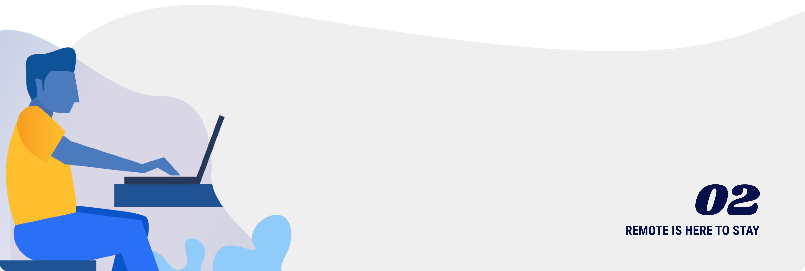

# Remote is here to stay

The resistance to remote has roots in the very place where innovative work culture began. Technology and investment leaders in Silicon Valley found initial success by hosting a lot of young, smart, scrappy people in a shared office for long periods of time. Those very companies invented the tools that make remote work possible.

### The remote spectrum: every company is already remote

Hint: If your company uses email, hosts meetings over video calls, or has shared wiki software - you’re already remote!

1. **Outsourced remote**: A company that works with remote contractors or agencies but not full-time. Companies like Headspace give you the option to WFH some days.
2. **Distributed offices**: A company that has multiple offices and headquarters. Google and Facebook charge these examples.
3. **Remote-first:** Companies support some remote workers, primarily in one country. They likely have an office in at least one main location.
4. **Fully remote**: A company has international employees who are remote most of the time. They get together for group offsite meetings a few times per year.
5. **Global distributed workforce:** Employees are working from **anywhere at any time**. They would rarely (if ever) need to bring the whole company together in the same physical space.

## Who are remote workers?

Making the switch to remote takes a transition period. You have to learn how to be a better communicator, more organized, and do more to build your own social community. Early adopters to the remote movement were often introverts and highly specialized knowledge workers. But modern tools and cultural shifts are making it possible for anyone to take part in this new flexible lifestyle.

### Introverts and extroverts

It’s a common misconception that working remotely is only good for introverts. On the Moonlight team, we have a mix of self-described "super extroverts," introverts, and people in-between. You _can_ have a ton of social time as a remote worker, with the added benefit of choosing where and when you work.

### More than just the gig economy

When companies first started experimenting with remote work, it was often in the form of outsourced projects. When a loosely-defined project accepts the lowest bid - you end up in revision hell with the cheapest possible implementation.

Now it’s possible to find the best possible talent, anywhere in the world. You get to work with them directly as an ongoing member of your team. This can manifest in a variety of ways - full-time employment, ongoing contract work, project-based milestones, or even technical mentorship. Hiring remotely is just another way to build a fantastic and scalable team.

### It’s not "work from home"

Yes, some remote workers choose to work from home. But remote can also mean working from a dedicated office in your local city, or a shared co-working or community space. The environment should be set up for productivity, with all the same things you would get in a traditional startup office.

## The competitive advantage of remote

When GitLab started their company, "remote" was a new concept. Investors turned down the company because it had no office. Two Sigma Ventures partner Villi Iltchev\*\* \*\*shared one of the first conversations he had with their CEO & Partner, Sid Sijbrandij:

EMBED [https://twitter.com/villi/status/1169316189434257413](https://twitter.com/villi/status/1169316189434257413)

As they have scaled to over 1000 employees the team turned "remote" from a _liability_ into an* asset*. Since their talent pool is so widespread, they have diverse perspectives and geographical coverage. And, they have spent less money directly on real estate.

Stripe, InVision, and Digital Ocean are more examples of startups who are scaling remote teams and succeeding. More and more companies are following suit (and following the talent).

We wrote up some simple talking points in case your investor asks about why you’re building a remote team:

- **Top talent:** If you can hire from anywhere, you can hire the best employees - wherever they are. Kong used this to find the top contributors to the Lua\*\* \*\*programming language, many of whom were living outside the U.S.

- **Diverse perspectives:** Not every person can relocate to San Francisco. Some may have families, student loans, or other realities that make the high cost of living impossible. Others may not have work rights in the USA, or cannot physically commute.

- **Faster hires:** For remote teams, hiring often becomes more demand-constrained than supply-constrained. We heard from one unicorn-size startup that opening a "remote" office radically switched their hiring approach from being proactive to reactive.

- **Increased productivity:** Commutes waste time, and offices are designed for control - not productivity. Remote workers have fewer interruptions, resulting in more deep work - and better results for the business.

- **Lower average costs:** If employees have to pay \$3k/mo for a studio apartment, then they need higher salaries. By hiring people outside of major cities, employees can have a higher standard of living on less salary.

The next wave of startups will be remote, and it will become increasingly inefficient and irrational to geo-restrict hiring.
