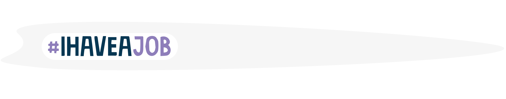

# Find a remote job

About third of your life is spent working, so it's not surprising that people are opting for a more flexible work-life balance. With the shift towards location-independent careers, there are tons of new possibilities that allow you to build a successful career on your terms.

While you may be working from _anywhere_, there are many other things to consider during the job search. You need to work on something interesting, get paid enough to reach your life goals, and feel like your career growth will be supported.

## The new resume - your online identity

Getting a foot in the door through a personal connection is no longer enough to land a job. Hiring managers can learn a lot about you by doing a quick search on Google. 

With your online identity, you need to prove that you have the **professional experience** to back up the technical requirements, and the **communication skills** to work remotely. 

#### Show off your communication ability 
This is extra important for remote teams. You need to be able to convey ideas to your teammates both live and in written form. Make sure your professional profiles show this with good grammar and clear, concise communication.

#### Prove that you are experienced
For remote companies, it’s likely that you have no personal connections inside the company. Your online presence needs to prove that you have done this kind of work in the past. List your past companies, show actual work completed, and explain what you personally did to create value.

#### Show off your technical skills 
Your hard skills are the baseline for why someone is interested in hiring you. Make sure you are telling them the tech stack you are an expert in, and back it up with any past projects using those skills.

#### Create a feeling of trust
Without an initial in-person meeting, it’s harder to make a personal connection. You need to come across as a trustworthy human on the other end. Use a real photo of yourself, write with a friendly and concise tone, and share a complete story about your personal and professional history.

<ClientOnly>
  <Tweet id="1072263742472126465" :options="{ conversation: 'none' }" />
</ClientOnly>

## Where to find remote jobs

Once your online identity is feeling polished and clear, it's time to start connecting with potential employers. Start building up your online network _before_ your ready for a new job. Sign up for as many tech communities and industry-specific forums as you can, and start engaging.

**Platforms and communities to find remote employment:**

- [Moonlight](https://www.moonlightwork.com/) (shameless plug!) Match to flexible and remote jobs, broadcast your availability,
and meet other developers to grow your career.

- [Key Values](https://www.keyvalues.com): Engineering teams describe their culture and how their values translate into daily practices.

- [Remotive](https://remotive.io): Browse 1000s of hand-picked remote jobs, updated daily. Remotive (est. 2014) helps tech professionals land remote jobs.

- [We Work Remotely](https://weworkremotely.com): We Work Remotely is the largest remote work community in the world. With over 2.5M monthly visitors, WWR is the #1 destination to find and list incredible remote jobs.

- [Remote.co](https://remote.co): Remote.co is your remote work resource. Learn from leading remote companies how to start, grow and manage virtual teams.

<ClientOnly>
  <Tweet id="1090978853537964033" :options="{ conversation: 'none' }" />
</ClientOnly>

## Nailing the remote interview

The interview process will be different for a fully remote team than for a co-located company. You may never meet someone in person before being given an offer. This means that your skills, interests, communication style, and personality need to come through in other ways.

#### Written interview questions
The first step in the interview process will likely be some kind of written screen. It’s easy to breeze through this step since it feels like a formality, but this is really where you should be spending the most time. It’s the first opportunity for you to stand out from other candidates, and it’s extremely important to prove that you are a great asynchronous communicator that can work remotely.

#### Video interviews
Try to get on a video call rather than a phone call for the first meeting. This gives you far more ways to connect with the interviewer. You can communicate with body language, express emotions through facial features, share your screen, and get a better feel for what the human on the other end is like.

#### Emails and chat
Talking with the team via email or chat is a test in itself. As a remote worker (no matter your job title), written communication will be your primary collaboration interface. You should be proving your skills already by following up after calls, communicating clearly, using proper grammar, and responding in a timely manner.

#### Technical project
Once you make it through the initial few screening conversations, you will likely be given a contract trial period or technical take-home project. This is your chance to prove your technical ability, daily communication style, and process. Even if they just ask you to complete a task, remember that it’s about the whole package - not just the end result. Even if it’s not requested, but sure to end the project with a presentation or video walk-through explaining your strategy and decisions.

<ClientOnly>
  <Tweet id="1129004528215322624" :options="{ conversation: 'none' }" />
</ClientOnly>

