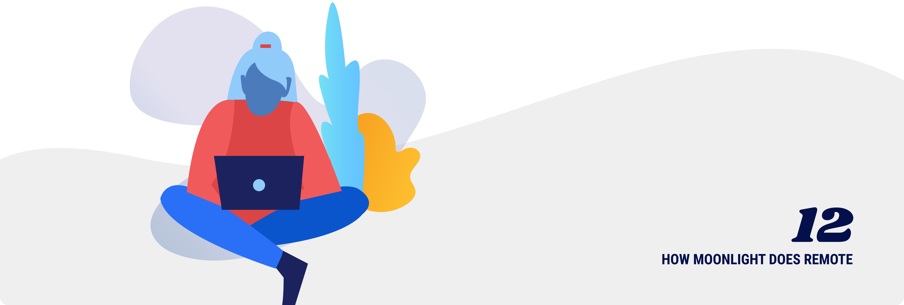

# How Moonlight does remote

This guide was brought to you by the Moonlight team and community of developers. We are a fully remote company, and are working to build a future where more people get to work with flexibility. Transparency is part of our DNA, so we’re hoping these resources will help you grow!

How Moonlight does remote work:

- Moonlight on the future of work - [https://www.moonlightwork.com/blog/values-future-of-work](https://www.moonlightwork.com/blog/values-future-of-work)

- Digital nomad’s guide to information security - [https://www.moonlightwork.com/blog/digital-nomad-guide-security](https://www.moonlightwork.com/blog/digital-nomad-guide-security)

- Growth charts for startups - [https://www.moonlightwork.com/blog/growth-charts](https://www.moonlightwork.com/blog/growth-charts)

- Startups shouldn’t hire a CTO - [https://www.moonlightwork.com/blog/startups-should-not-hire-a-cto](https://www.moonlightwork.com/blog/startups-should-not-hire-a-cto)

- Storytelling: the key to getting hired - [https://www.moonlightwork.com/blog/storytelling-the-key-to-getting-hired](https://www.moonlightwork.com/blog/storytelling-the-key-to-getting-hired)

- How to find a technical co-founder - [https://www.moonlightwork.com/blog/finding-a-technical-co-founder](https://www.moonlightwork.com/blog/finding-a-technical-co-founder)

Coming soon:

- **Communication best practices** - We have a list of all the communication tools we use, with best practices on how and when to use each one. Email lists are the top tool on the priority list, synchronous tools like Slack follow.

- **Daily Standup for remote teams** - Each morning to set routine and goals for the day. This is done over Slack, and each team member posts their update at the beginning of the day in their time zone.

- **Weekly sprint planning** - We set up one meeting for each team (product, marketing, growth, founders). There’s a meeting each Monday to plan and feel like there’s an official kick-off for the week.

- **All hands** - We do a full team meeting every Friday. It’s run over Zoom, with each team member joining from a different computer. We talk about company goal progress, celebrate wins, and talk through top items for each team.

- **Weekly internal update email** - Each Monday, we send a structured email to get everyone on the same page and motivated. It includes company goals, weekly stats, and highlights what each team has completed and in-progress.

- **Monthly investor update email** - We send a monthly email to investors with the same sections each time. We talk through goals, stats, highs, lows, and asks.

- **Meeting-free Thursday** - Each Thursday is designated a no-meeting day. There are no recurring meetings, and only spontaneous meetings if absolutely necessary. It clears up time for each team member to have devoted deep work time.

- **Metrics dashboard** - We share graphs and metrics that are core to the health of our business through the admin portal of our app. All employees have admin accounts, and this is the first page they see when logging into the app. It keeps incentives aligned, and adds transparency to how we run the business.

- **Offsites** - We do in-person offsites 2-3 times per year. As a remote team, this is the time to connect on a personal level and collaborate on ideas.

- **Videos instead of meetings** - When events happen that don’t require a meeting, like a product handoff, or bug report - we use Loom videos. This screen recording software is a great way to communicate complicated ideas in a quick and effective way.
