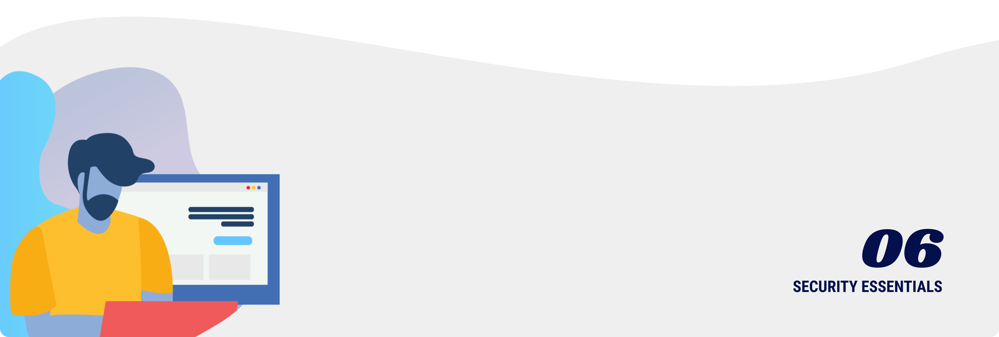

# Security essentials

In an office, you can lock the doors and even hire a security guard. You can talk face-to-face with somebody to verify that their requests are legitimate. And, you can walk over to a broken computer to fix it or install new software.

Building a distributed team introduces new challenges for data security, authentication, and ongoing support. In this section, we will cover our best practices for securing workers with no office.

<ClientOnly>
  <Tweet id="535150247031607296" :options="{ conversation: 'none' }" />
</ClientOnly>

## Security for software contractors

When working with software contractors, you do not own or control their computer. So, you need to think about security differently. It’s important to have a security process and written documentation in place before getting started.

#### Work contract

Have a solid legal agreement in place. If you don’t have a legal team, we recommend using the free [Consulting Agreement Generator](https://www.cooleygo.com/documents/form-consulting-agreement/) from the famous Cooley law firm.

While many founders are fixated on getting a non-disclosure agreement in place, this is not enough! A good contractor agreement does include non-disclosure, but also includes other terms such as an **assignment agreement**. Without an assignment agreement, you do not own the work of your contractor - even if you pay them! This sounds unintuitive, but can cause huge problems for your business later. So, take contracts seriously.

#### Insurance

You cannot guarantee the security of somebody else's laptop. The standard for working with software contractors is to require proof of professional liability insurance that covers errors and omissions.

This insurance doesn't cost the developer much (a couple of hundred dollars per year), but protects your business in a variety of scenarios - ranging from the freelancer getting hacked and losing your customer information, to them writing code that has a major security vulnerability.

Some insurance providers, such as [Coalition](https://www.thecoalition.com/) even provide a phone number to use for getting immediate help with cyber incidents. Any major enterprise requires this insurance from their software contractors, and you should too!

#### Control the code

Have all code under version control—through [Github](https://github.com), [GitLab](https://gitlab.com), [Bitbucket](https://bitbucket.org/product), or another version control service — so that all parties can maintain the complete history of work.

If there is a dispute or lapse, you do not want to lose access to the code which you own. Maintain admin or owner rights to the repositories so that you can manage access as contractors ramp up and ramp down from the project. Clearly communicate to the contractor what they can and cannot do within the repository.

#### Access to a development environment

Have a production-like environment where contractors can develop, deploy, and test their code before it is pushed to production. Ensure that it is isolated from production data so that contractors do not have access to sensitive information unnecessarily.

#### Proper code reviews

Ensure that the code being committed is the code you expect. Review for correctness to the solution, correct security primitives, ensure there are no backdoors, and that it matches your code style.

Use automation when possible to scan for problems. Consider setting up your code repository to enforce code reviews so that people cannot singlehandedly push code to production. Disable "force push" support in Git so that nobody can erase code history.

#### Jurisdiction

If your business has strong concerns about security, then you should consider the maturity of the local court system where your contractor resides. Nobody wants to go to court, but if you do have to litigate - you stand a better chance of enforcing your contract if the contractor lives in your local country or one with mature laws.

## Remote employee computers

#### Own the computer

This might sound basic, but there's a temptation in a remote team to let employees use their personal computers. This is unprofessional, a security risk, and potentially illegal.

Buy everybody a computer so that you can set the security policy without infringing on the personal lives of employees. Have a policy about what personal usage of work computers is allowed. Regardless of that policy - make it clear that, if there is ever a security breach, nothing on that work computer is off-limits.

#### Remote admin access

You cannot walk over to somebody's computer to fix it, so you need a way to enforce security. For Macs, we recommend [Fleetsmith](https://www.fleetsmith.com/) - which has a generous free plan. Other options include [osquery](https://osquery.io/) and [Puppet](https://speakerdeck.com/wfarr/the-setup-managing-an-army-of-laptops-with-puppet).

Even just using these apps to keep track of the computers you own and their serial numbers is helpful.

#### Enforce encryption everywhere

Enforcing full-disk encryption is probably the best security step that you can take for remote workers. If an encrypted laptop goes missing or is stolen, then you don't lose any data or customer information.

Use a tool like [Fleetsmith](https://www.fleetsmith.com/) to enforce encryption and maintain admin access to the device.

<ClientOnly>
  <Tweet id="760296658475229185" :options="{ conversation: 'none' }" />
</ClientOnly>

#### Harden the operating system

Every operating system has different configurations that can be enabled to make it safer. At a minimum, keep software up-to-date and turn on a firewall. Beyond that, research your operating systems for guides to increase their security.

#### Back up the data

Use a tool such as [Backblaze](https://www.backblaze.com/) or [Crashplan](https://www.crashplan.com/en-us/) to back up all company computers to the cloud. This minimizes the inconvenience of losing a computer, and can aid in recovering from certain kinds of cyber attacks. By enabling encryption through this software, you prevent even the backup provider from having access to your sensitive data.

## Ensure identity through authentication

On a distributed team, you must protect the "log in" process with all possible resources. If a hacker gets access to a remote employee's chat or email system, then nobody may realize it until serious damage is done.

#### Password manager

In today's security environment, you need a different password for every website. This prevents credential stuffing attacks. Humans are incapable of memorizing this many passwords, so we recommend [1Password Teams](https://1password.com/teams/).

#### Safely share secret information

Teams need to share secret information with each other, such as database passwords. You need to define a protocol for your team to share these secrets with each other. Do not pass shared account passwords around via email, Slack, or text message! Otherwise, the hacking of one system can result in the breaches of other systems.

A safe solution should encrypt the data directly between users. We recommend using [1Password](https://1password.com) for this, but [Keybase](https://keybase.io/) and [PGP](https://en.wikipedia.org/wiki/Pretty_Good_Privacy) work as well.

#### Enforce two-step verification for everything

Secure account access should always rely on something you know, and something you have. Explain the importance of enabling a second factor for all online accounts to employees, and enforce it as a requirement where possible (e.g., on [Slack](https://slack.com/help/articles/212221668-Mandatory-workspace-two-factor-authentication-) and [Github](https://help.github.com/en/github/setting-up-and-managing-organizations-and-teams/requiring-two-factor-authentication-in-your-organization)).

The most secure second-factor is [Fido U2F](https://www.yubico.com/fido-u2f/), which uses a phishing-proof USB key to verify identity. We strongly recommend issuing these physical keys to all employees!

#### Block bad passwords

We recommend implementing the [Have I Been Pwned API](https://haveibeenpwned.com/API/v3) into your application to block unsafe passwords.

Using a very safe and anonymous protocol, their API will tell you when users are using a password that showed up on other websites. It's free, and takes minimal code to implement. This prevents most credential-stuffing attacks, and protects all users of your application.

#### Don't trust third-party VPNs

We do not recommend relying on corporate VPN products for security. If you use a third-party VPN, then the VPN provider has access to your data (and [can lose it](https://techcrunch.com/2019/10/21/nordvpn-confirms-it-was-hacked/)). Instead, implement a [zero-trust](https://cloud.google.com/beyondcorp/) model like Google where you build authentication authorization into your app.

To do this, we recommend securing internal tools with proxies such as [Cloudflare Access](https://www.cloudflare.com/products/cloudflare-access/) or [Google Context-Aware Access](https://cloud.google.com/context-aware-access/). These tools unify the security and authorization process.

## Train employees on operational security

It's important to talk to employees about security. Set sensible polices, such as locking computers when they are not in use.

The most likely breach to occur is through phishing, where somebody tries to trick an employee to give them their password. Security training doesn't sound fun, but it's one of the most effective things that you can do to protect your team.

<ClientOnly>
  <Tweet id="864167820162088961" :options="{ conversation: 'none' }" />
</ClientOnly>

- [Security Training for Everyone (PagerDuty)](https://sudo.pagerduty.com/for_everyone/): This is an open-source version of "Security Training for Everyone", PagerDuty's internal employee security training, given to all PagerDuty employees as part of our annual security training program.

- [International travel guide (Basecamp)](https://github.com/basecamp/handbook/blob/master/international-travel-guide.md): If you travel out of the country for business purposes—to a company meetup or a professional conference—or even on a family vacation with your work laptop, you're facing up to questions about business visitor visas, customs, and border security. We have answers!

- [Slack Security Incident (Keybase)](https://keybase.io/blog/slack-incident): I reset all of my passwords, threw away all my computers, bought new computers, factory-reset my phone, rotated all of my Keybase devices (i.e., rotated my "keys"), and reestablished everything from the ground up.

- [Digital Nomad's Guide to Information Security (Moonlight)](https://www.moonlightwork.com/blog/digital-nomad-guide-security): Hello from Barcelona! Last week, somebody stole the Moonlight team’s laptops out of our Airbnb. I have been spending the last few days configuring our new MacBooks. So, I am sharing the steps that we take to keep data secure.

